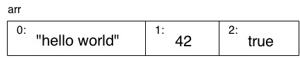

# You Don't Know JS: Up & Going
# Chapter 2: Into JavaScript

앞 장에선 변수,반복문,조건문, 함수와 같은 프로그래밍의 기본 구성요소들을 설명했습니다. 당연히 이 모든 것들은 자바스크립트에도 있습니다. 그러나 이번 장에서는 JS 개발자로서 일어나고 나아가기 위해 자바스크립트에 대해 알아야 할 것들을 구체적이고 중점적으로 다루고자 합니다.

우리는 이 장에서 다음 YDKJS 책들까지는 충분히 탐구되지 않을 꽤 많은 개념들을 소개할 것입니다. 이 장은 이 시리즈의 나머지 부분에 걸쳐 자세히 다루어질 주제들의 개요정도로 생각할 수 있습니다.

특히 자바스크립트를 처음 접하는 경우, 여기서 개념과 코드 예를 여러번 검토하는데 꽤 많은 시간을 할애할 것으로 예상해야 합니다. 모든 기초는 차근차근 이루집니다. 따라서 처음부터 바로 이해할 것이라고 기대하면 안됩니다.

## Values & Types
1장에서 말했듯이 자바스크립트에는 타입이 지정되지 않은 변수에 값이 입력됩니다. 다음과 같은 타입들이 기본적으로 제공됩니다.:

* `string`
* `number`
* `boolean`
* `null` and `undefined`
* `object`
* `symbol` (new to ES6)

자바스크립트는 값을 검사하고 그 타입을 알려주는 `typeof`라는 연산자를 제공합니다.:

```js
var a;
typeof a;				// "undefined"

a = "hello world";
typeof a;				// "string" - 문자열

a = 42;
typeof a;				// "number" - 숫자

a = true;
typeof a;				// "boolean" - 참,거짓

a = null;
typeof a;				// "object" -- bug

a = undefined;
typeof a;				// "undefined" - 정의되지 않음

a = { b: "c" };
typeof a;				// "object" - 객체
```
`typeof` 연산자의 반환값은 항상 6가지 문자열 중 하나입니다.(ES6 에서는 7가지! - "symbol"타입) 이것은 `typeof "abc"`의 결과가 `string`이 아닌 `"string"`이라는 뜻입니다.

이 `a` 변수는 모두 다른 유형의 값을 가지고 있으며 `typeof a`는 "`a`의 타입"이 아니라 "현재 `a`에 들어있는 값의 타입"을 요구합니다. 자바스크립트에서는 값에만 타입이 존재합니다.; 변수는 이러한 값들에 대한 그릇일 뿐입니다.

`typeof null`은 흥미로운 경우인데, 왜냐하면 네가 결과값으로 예상한 `"null"`이 아닌 `"object"`를 반환하기 때문입니다.

**Warning:** 이것은 JS의 오래된 버그이지만, 결코 고칠 수 없는 버그입니다. 너무나 많은 웹 상의 코드들이 이 버그에 의존하고 있어 이 버그를 수정한다면 더 많은 버그가 발생합니다!

또한 `a = undefined`에 유의하세요. 우리는 명시적으로 `a`를 `undefinded`값으로 설정하고 있습니다. 그러나 이것은 아직 값이 설정되지 않은 변수와 행동 상으로는 차이가 없습니다. 예를 들어, 상단의`var a;`라인과 같습니다. 변수는 값을 반환하지 않는 함수와 'void'연산자의 사용법을 포함하여 여러 가지 다른 방법으로 "정의되지 않은" 값 상태에 도달 할 수 있습니다. 

### Objects
`object` 타입은 각각의 타입의 값을 가지고 있는 속성(locations라고 불림)을 설정할 수 있는 복합적인 값을 참조합니다. 아마 모든 자바스크립트 타입들 중 가장 유용할 것입니다.

```js
var obj = {
	a: "hello world",
	b: 42,
	c: true
};

obj.a;		// "hello world"
obj.b;		// 42
obj.c;		// true

obj["a"];	// "hello world"
obj["b"];	// 42
obj["c"];	// true
```

`obj` 값을 시각적으로 아래와 같이 이해하면 도움이 될 것입니다.:


각 속성에 *점 표기법* (i.e., `obj.a`)이나 *대괄호 표기법* (i.e., `obj["a"]`)을 이용하여 접근할 수 있습니다. 점 표기법은 짧고 일반적으로 읽기가 쉽기 때문에 가능한 경우 선호됩니다.

대괄호 표기법은 `obj [ "hello world!"]`와 같은 특수 문자가 있는 속성 이름을 가진 경우 유용합니다. 대괄호 표기법을 통해 접근할 때 이러한 속성을 종종 *키* 라고 합니다. `[]`표기법은 변수 (다음에 설명) 또는 `string` *리터럴*(``.. "`또는`.. ..``로 묶을 필요가 있습니다.)을 필요로 합니다.


물론 대괄호 표기법은 속성/키에 접근하려고 하지만 이름이 다음과 같은 다른 변수에 저장되는 경우에도 유용합니다.:

```js
var obj = {
	a: "hello world",
	b: 42
};

var b = "a";

obj[b];			// "hello world"
obj["b"];		// 42
```
**Note:** 자바스크립트의 `object`에 대한 자세한 내용은 이 시리즈의 *this & Object Prototypes*, 특히 3장을 참조하십시오.

자바스크립트 프로그램에서 일반적으로 상호작용할 수 있는 몇가지 다른 타입들이 있습니다.:*array* 나 *function* 
그러나 이러한 것들은 기본 제공 타입이 아닌 `object`의 하위 유형(특수 버전) 정도로 생각해야 합니다.

#### Arrays
배열은 특별히 명명 된 속성 / 키가 아닌 숫자로 색인 된 위치에있는 값 (모든 유형의 값)을 보유하는 `object`입니다.예 :
```js
var arr = [
	"hello world",
	42,
	true
];

arr[0];			// "hello world"
arr[1];			// 42
arr[2];			// true
arr.length;		// 3

typeof arr;		// "object"
```
**Note:** JS와 같이 0에서 시작되는 언어는 배열의 첫 번째 요소의 인덱스로 `0`을 사용합니다.

`arr`을 시각적으로 생각하면 아래와 같습니다.:



왜냐하면 배열은 특별한 객체이고(`typeof`가 의미하는 것 처럼) 
그들은 자동적으로 업데이트 된`length` 속성을 포함하는 속성을 가질 수 있습니다. 이론적으로 당신이 명명한 속성을 가진 정상적인 객체로 배열을 사용하거나 `object`에 숫자 속성(`0`,`1` 등)만 부여하여 배열과 비슷하게 사용할 수 있습니다. 그러나 이것은 일반적으로 부적절한 사용법입니다.

가장 좋고 자연스러운 접근법은 배열을 수치적으로 배치된 값에 사용하고 지정된 속성에는 `object`를 사용하는 것입니다.

#### Functions
JS 프로그램 전반에서 사용될 또 다른 `object`의 하위 타입은 함수이다:

```js
function foo() {
	return 42;
}

foo.bar = "hello world";

typeof foo;			// "function"
typeof foo();		// "number"
typeof foo.bar;		// "string"
```
다시 말하지만, 함수는`objects`의 하위 유형입니다. --`typeof`는`"function"`을 반환합니다. 이것은 `function`이 메인 타입이라는 것을 의미합니다. 따라서 속성을 가질 수는 있지만 일반적으로 제한된 경우에 함수 객체 속성 만 사용합니다. (`foo.bar`와 같은)

**Note:** JS 값 및 유형에 대한 자세한 내용은 이 시리즈의 *Types & Grammar*의 처음 두 장을 참조하십시오.

### Built-In Type Methods

방금 살펴본 내장 타입 및 서브타입은 매우 강력하고 유용한 속성 및 메소드로 표시되는 행동을 포함합니다.

예를 들면:

```js
var a = "hello world";
var b = 3.14159;

a.length;				// 11
a.toUpperCase();		// "HELLO WORLD"
b.toFixed(4);			// "3.1416"
```

`a.toUpperCase()`을 호출하는 "방법" 은 그 값에 존재하는 메서드보다 훨씬 복잡합니다.

간단히 말하면, "native"라고 불리는 `String`(대문자 `S`) 객체 랩퍼 형식이 있는데 이는 원시 `string` 타입과 쌍을 이룹니다. 이 프로토타입에 객체 랩퍽가 `toUpperCase()` 메소드를 정의합니다.

당신이 `"hello world"`같은 값을 속성이나 메소드(e.g., `a.toUpperCase()` 이전 내용에서 처럼)를 참조하여 사용할 때, JS는 자동적으로 그 값을 자동적으로 해당 객체 래퍼와 대응하여 "boxes"합니다.(상자 아래 숨깁니다.)

`string` 값은 `String` 객체에, `number`는 `Number` 객체에, 그리고 `boolean` 는  `Boolean` 객체에 묶일 수 있습니다. 대부분의 경우 당신은 이에 대해 걱정할 필요가 없거나 이러한 객체 랩퍼 형식을 직접적으로 사용할 일이 없습니다. 모든 경우 기본적인 형식을 선호하고 자바스크립트가 나머지 부분은 알아서 처리해줍니다.

**Note:**  JS natives와 "boxing"에 관한 더 많은 정보는 이 시리즈 *Types & Grammar*의 3장에서 더 다룰 겁니다. 객체의 프로토타입에 대해 더 잘 이해하려면 *this & Object Prototypes*의 5장을 참고하세요.

### Comparing Values
비교 연산자에는 두가지 메인 타입이 있다: *equality* and *inequality*. 모든 비교의 결과는 당신이 어떤 타입을 비교하여도 반드시 `boolean`(`true` or `false`)이다.

#### Coercion
1장에서 간략하게 타입 변환에 대해 살펴봤지만 여기서 다시 한번 살펴봅시다. 

타입 변환 은 자바스크립트에서 두가지 타입이 있습니다:  *명시적 타입 변환* 과 *암묵적 타입변환(강제 변환)* 입니다.

명시적 타입 변환은 단순히 코드 상에서 당신을 타입을 뭐로 바꿀 것인지를 명백하게 볼 수 있습니다. 반변에 암묵적 타입 변환은 다른 작업의 명확하지 않은 부작용으로 생기는 경우가 많습니다.

아마 타입 변환이 어떤 놀라운 결과를 나타낸다는 것이 분명하다는 점에서 나온 "타입 변환은 악이다"라는 감정 섞인 말을 들어보았을 겁니다. 하지만 타입변환은 악도 아니고 놀랄 필요도 없습니다. 사실 대부분의 경우는 상당히 합이적이고 이해 가능하며 심지어 코드의 가독성을 높이는데 사용될 수 있습니다. 그러나 이에 대한 이야기는 여기선 더 이상 하지 않을 것입니다.--*Types & Grammar* 4장에서 다룰 것입니다.

명시적 변환의 예시:
```js
var a = "42";

var b = Number( a );

a;				// "42"
b;				// 42 -- the number!
```

암묵적 변환의 예시:

```js
var a = "42";

var b = a * 1;	// "42" implicitly coerced to 42 here

a;				// "42"
b;				// 42 -- the number!
```

#### Truthy & Falsy

1장에서 "참" 그리고 "거짓"에 대해 간단히 살펴봤습니다. 만약 `boolean` 값이 아닌 것을 `boolean`로 타입 변환 한다면 이것은 `true` 일까요 `false` 일까요?

자바스크립트의 "거짓" 값의 구체적인 목록은 아래와 같습니다:
* `""` (empty string)
* `0`, `-0`, `NaN` (invalid `number`)
* `null`, `undefined`
* `false`

그리고 이 목록에 없는 값들은 "참" 입니다. 예를 들어 보면,

* `"hello"`
* `42`
* `true`
* `[ ]`, `[ 1, "2", 3 ]` (arrays)
* `{ }`, `{ a: 42 }` (objects)
* `function foo() { .. }` (functions)

`boolean`이 아닌 값들은 `boolean`으로 타입 변환 됐을 때만 "참/거짓"을 가진다는 사실을 기억하는 것이 중요합니다. 그렇지 않을 때 `boolean` 에게 가치를 강요하는 듯한 상황과 자신을 혼동하는 것은 그리 어려운 일이 아닙니다.

#### Equality
총 4가지 equality 연산자가 있습니다:  `==`, `===`, `!=`, `!==`. `!`는 좌우가 "같지 않다"를 의미합니다. 이때 *같지 않다* 를  *평등하지 않다* 와 혼동하면 안됩니다.

`==`과 `===`의 차이는 보통 `==`는 값이 같은 지 비교하고 `===`는 값과 타입 모두 같은 비교합니다. 하지만 이것은 정확하지 않습니다. `==`는 타입 변환을 허용하여 값이 값은 지를 확인하고 `===`는 타입변환을 허용하지 않습니다. 이러한 이유로 `===` 를 "strict equality"라고 부릅니다.

암묵적 타입 변환은 `==` 에서는 허용되지만 `===`에서는 허용 안된다는 걸 잊지마세요:

```js
var a = "42";
var b = 42;

a == b;			// true
a === b;		// false
```

`a == b`에서 JS는 타입은 동일하지 않다는 걸 알곤 두 값만을 비교하기 위해 한 쪽 혹은 두 값 모두 타입을 통일시키기 위한 일련의 작업을 합니다.

위와 같은 것을 생각했을 때 `a == b`는 타입 변환을 할 수 있는 두가지 방법이 있습니다. `42 == 42` 또는 `"42" == "42"` 가 가능합니다. 그렇다면 정답은 무엇일까요?

정답은: `"42"` 가 `42`로 바뀌면서 `42 == 42` 이러한 방식으로 비교하게 됩니다. 이처럼 간단한 예에선 최종결과가 같기 때문에 그 과정이 어느 방향이냐가 별로 중요하지 않아 보일 수도 있습니다. 비교의 결과가 무엇인지 뿐만 아니라, *어떻게* 해야 그 결과를 얻을 수 있는지가 더 복잡한 경우도 있습니다.

타입 변환이 허용되지 않기 때문에 `a === b` 의 결과는 `false` 입니다. 따라서 단순히 값 비교도 실패입니다. 많은 개발자들이  `===`이 훨씬 예측 가능하다고 생각하여 `==`의 사용을 멀리해야 한다고 말합니다. 저는 그 관점이 굉장히 근시안적이라고 생각합니다. `==`이 *어떻게 동작하는지 배우는 시간을 가진다면* 이는 굉장히 좋은 툴이라고 생각합니다.

여기서 `==` 의 타입 변환이 어떻게 작용하는지에 대한 핵심적인 세부사항을 다 다루지는 않을 것입니다. 상당부분은 합리적이지만, 주의해야할 몇가지 중요한 케이스가 있습니다. ES5 규격(http://www.ecma-international.org/ecma-262/5.1/)의 섹션 11.9.3을 읽고 정확한 규칙을 확인할 수 있으며, 이를 둘러싼 모든 부정적인 과장과 비교해보면 이 메커니즘이 얼마나 간단한지 놀라실 겁니다.

간단한 몇 가지 작업으로 모든 세부 사항을 요약하고, 다양한 상황에서 '==' 또는 '==='를 사용할지 여부를 알기위한 다음과 같은 간단한 규칙을 소개합니다.

* 어느 하나의 값이 `true` 나 `false` 일 수 있다면 , `==`를 피하고 `===` 를 사용합시다.
* 두 값 중 하나가 이 특정 값들 중 하나에 속한다면 (`0`, `""`, 또는 `[]` -- 빈 배열), `==` 말고 `===`를 사용합시다.
* 다른 *모든* 경우들은, `==`를 사용해도 안전합니다. 안전할 뿐 아니라 많은 경우 코드의 가독성을 향상시킵니다.

이 규칙들을 요구하자면, 여러분이 여러분의 코드에 대해 비판적으로 생각할 것과 equality를 위해 비교되는 변수를 통해 어떤 종류의 값들이 나올 수 있는지에 대해 생각할 것을 요구합니다. 값을 확신할 수 있다면 `==`를 사용해도 됩니다! 하지만 확신 할 수 없다면 `===`을 사용하세요.

`!=` 는 `==` 와 짝이고 `!==`는 `===`와 짝인 부정형입니다. 위에서 이야기한 규칙들이 모두 동일하게 적용됩니다.  

`object`(`function`,`array`포함) 처럼 기본 값이 아닌 두 값을 비교하는 경우에는 `==` 와 `===` 비교 규칙에 특별히 유의해야합니다. 이러한 값들은 실제로는 참조로 유지되기 때문에 `==` 와 `===` 의 비교는 단순히 참조의 일치 여부만 확인 할 뿐 기최가 되는 값에 대해선 아무것도 확인할 수 없습니다.

예를 들어, `array`는 기본적으로 쉼표(',')를 사이에 두고 모든 값을 결합함으로써 `string`로 타입 변환됩니다. 같은 내용을 가진 두 개의 `array`가 동등하다고 생각할지 모르지만, 사실은 그렇지 않습니다.

**Note:** `==`에 대한 자세한 내용은 ES5 규격(section 11.9.3)을 참조하고 이 시리즈의 *Types & Grammar* 4장을 참고하세요. 값 과 참조 대한 자세한 내용은 2장을 참조하세요.

#### Inequality
`<`, `>`, `<=`, `>=` 연산자는 부등호로 사용되며, "관계형 비교"라고 부럽니다. 전형적으로 `number`와 같은 일반적으로 비교 가능한 값을 비교하는데 사용됩니다. 

그러나 자바스크립트에선 `string` 값 또한 일반적인 알파벳 규칙 (``bar "<"foo "`)을 사용하여 비교할 수도 있습니다.

타입 변환은 어떨까요? `==`(똑같은 것은 아니지만!)와 비슷한 규칙이 적용됩니다. 주목할 만하게, 엄격한 불평등 연산자는 `===` 와 같은 방식으로 타입 변환을 허용하지 않습니다.

예를 들어봅시다:
```js
var a = 41;
var b = "42";
var c = "43";

a < b;		// true
b < c;		// true
```
여기선 무슨 일이 있던 걸까요? ES5의 11.8.5를 보면 `b < c` 처럼 `<`로 비교되는 값들이 모두 `string` 이라면 사전 순으로 비교된다고 합니다. 그러나 한쪽이나 양쪽이 `string`이 아니라면 양쪽 모두 `number`로 변환되고 일반적인 숫자 비교를 합니다.

잠재적으로 다른 값 타입들 사이를 통해 생길 수 있는 가장 큰 문젠 다음과 같습니다--"엄격한 부등호"의 형식이 없습니다.-- 값 중 하나를 숫자로 만들 수 없는 경우입니다. 예를 들면:

```js
var a = 42;
var b = "foo";

a < b;		// false
a > b;		// false
a == b;		// false
```

어떻게 세 경우 모두 `false`일 수 있을까요? 왜냐하면 `<` and `>` 비교에서 `b` 값은 " 비교에서 유효하지 않은 숫자" `NaN`로 변환되기 때문입니다. `NaN`는 다른 값들보다 크지도 작지도 않습니다.

`==` 가 거짓인건 다른 이유 때문입니다. `a == b`는 `42 == NaN`로 바뀌거나 `"42" == "foo"`로 바뀌어도 비교할 수 없기 때문입니다 -- 앞에서도 설명했듯이, 전자입니다.

**Note:** inequality 규칙에 대해 더 알고싶다면 ES5의 11.8.5를 참고하세요. 또한 *Types & Grammar* 4장에서 더 다룰 것 입니다.

## Variables
자바스크립트에서 변수 이름(함수 이름 포함)은 유효한 *식별자* 여야 합니다. Unicode와 같은 비 전통적 문자를 고려할 때 식별자의 유효한 문자에 대한 엄격하고 완전한 규칙은 약간 복잡하지만 일반적인 ASCII 만 고려한다면 규칙은 간단합니다.

식별자는 반드시 `a`-`z`, `A`-`Z`, `$`, `_` 로 시작해야합니다. 그런 다음 해당 문자와 숫자 '0`-`9`를 더할 수 있습니다.

일반적으로, 변수 식별자와 동일한 규칙이 속성 이름에도 적용됩니다. 그러나 특정 단어는 변수로 사용할 수 없지만 속성으론 사용할 수 있습니다. 이러한 단어들을 "예약어"라고 부르며 JS 키워드 (`for`, `in`, `if` 등) 뿐만 아니라 `null`, `true`, `false`도 포함되어 있습니다.

**Note:** 예약어에 대해 더 알고싶다면 *Types & Grammar*의 Appendix A를 확인하세요.

### Function Scopes
`var` 키워드를 사용하여 현재 함수 범위에 속하는 변수를 선언하거나 함수 외부의 최상위 레벨에 있으면 전역 변수로 선언합니다.

#### Hoisting
범위 안에서 `var`이 나타날 때마다 그 선언은 전체 범위에 속하고 어디에서나 접근 가능합니다. 

비유적으로, `var` 선언이 개념적으로 그를 둘러 싸는 범위의 상단으로 "이동"될 때 이러한 현상을 *hoisting* 라 부릅니다. 기술적으로, 이 과정은 코드가 어떻게 컴파일되는지에 의해 더 정확하게 설명되지만, 지금은 세부사항은 건너뛸 겁니다.

```js
var a = 2;

foo();					// works because `foo()`
						// declaration is "hoisted"

function foo() {
	a = 3;

	console.log( a );	// 3

	var a;				// declaration is "hoisted"
						// to the top of `foo()`
}

console.log( a );	// 2
```

**Warning:** `var` 선언보다 범위 앞에서 변수를 사용하기 위해 변수 *hoisting* 에 의존하는 것이 일반적이거나 좋은 생각이 아닙니다. 그것은 매우 혼란스러울 수 있습니다. 공식 선언 전에 나타나는`foo ()`호출과 마찬가지로 함수 호출을 사용하는 것이 훨씬 더 일반적입니다.